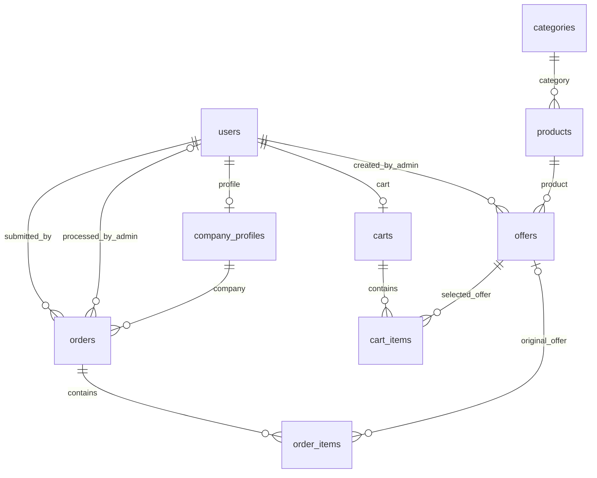

# Схема базы StockFlow

Основание: `2 daļa.docx`, разделы 2.3.1–2.3.3. Указанный в сообщении путь на Desktop
отсутствовал; использован одноимённый файл `C:\Users\hunde\Downloads\2 daļa.docx`.
В нём девять таблиц. Имена физических таблиц приведены к нижнему регистру,
чтобы одинаково работать на Windows и Linux.

| Таблица / модель | Содержание | Уникальные поля |
| --- | --- | --- |
| `users` / `User` | Аккаунты, хеш пароля, имя, роль, активность, дата | `email` |
| `company_profiles` / `CompanyProfile` | Компания, регистрационный номер, адрес, PVN, телефон | `user_id` |
| `categories` / `Category` | Название и описание категории | `name` |
| `products` / `Product` | Категория, SKU, название, бренд, модель, описание, единица, активность, дата | `sku` |
| `offers` / `Offer` | Товар, автор-администратор, поставщик, цена, PVN, остаток, доставка, источник, обновление | — |
| `carts` / `Cart` | Одна текущая корзина пользователя, даты | `user_id` |
| `cart_items` / `CartItem` | Предложение и количество в корзине | `(cart_id, offer_id)` |
| `orders` / `Order` | Покупатель, профиль компании, статус, сумма, решение администратора | — |
| `order_items` / `OrderItem` | Исторические названия, цены, PVN, количество, доставка и сумма строки | — |

Идентификаторы и FK — `BIGINT UNSIGNED` в MySQL; все PK автоматически назначаются.
Для SQLite в тестах используется `INTEGER`, необходимый для автоматической
нумерации. Таблицы MySQL используют InnoDB, `utf8mb4` и `utf8mb4_unicode_ci`.
Уникальность строковых значений в MySQL зависит от этой регистронезависимой
сортировки. Цены — `DECIMAL(10,2)`, суммы заказа и строки — `DECIMAL(12,2)`;
в Python следует передавать `Decimal`, а не результаты расчётов с `float`.

## Обязательность и значения по умолчанию

Все поля обязательны, кроме явно необязательных данных: `vat_no`, `phone`,
описания категории и товара, `brand`, `model`, `supplier_sku`, `admin_note`,
`processed_by_admin_id`, `processed_at`, `order_items.offer_id`.
Необязательность описания товара взята из раздела 2.1.4 документа.

- Пользователь: `role='user'`, `is_active=1`.
- Товар: `unit='gab.'`, `is_active=1`.
- Предложение: `min_order_qty=1`, `stock_qty=0`, `delivery_price=0`,
  `delivery_days=0`, `data_source='manual'`, `is_active=1`.
- Корзина: `status='active'`; заказ: `status='iesniegts'`.
- Даты создания/обновления получают `CURRENT_TIMESTAMP` на стороне БД.
  Соединения MySQL используют UTC; `updated_at` обновляется при UPDATE через
  SQLAlchemy. Изменение позиций корзины отдельно требует обновления времени
  родительской корзины в будущей бизнес-логике.
- Цена, количество, PVN и суммы заказа задаются явно — для них нет скрытой
  подстановки. Минимум количества предложения — 1, количеств строк — больше 0;
  цены, остатки, сроки доставки и суммы неотрицательны.

Допустимые роли: `user`, `admin`; статусы заказа: `iesniegts`, `apstiprināts`,
`noraidīts`; источники: `manual`, `CSV`, `JSON`, `API`. Ограничения CHECK и
NOT NULL действуют и при прямом SQL. Пароли задаются через `User.set_password()`
и проверяются через `check_password()`; гостям запись пользователя не создаётся.

## Удаление и история

- Удаление категории с товарами или товара с предложениями запрещено (`RESTRICT`).
- Пользователи/профили, связанные с заказами, и авторы предложений/решений
  защищены от удаления. Для отключения аккаунтов используется `is_active`.
- При удалении пользователя его корзина удаляется каскадно, если другие FK
  не запрещают удаление пользователя. Профиль компании нужно удалять явно.
- Удаление корзины удаляет её позиции. Удаление предложения удаляет его позиции
  из текущих корзин, но оставляет позиции заказов с `offer_id=NULL`.
- Существующие предложения и товары можно архивировать через `is_active=False`.
- При явном удалении заказа его строки удаляются каскадно. Обычный рабочий
  процесс должен сохранять заказы и менять их статус.

Названия товара и поставщика, цена, доставка, PVN и количество в `order_items`
являются сохранёнными значениями, а не вычислением из текущего предложения.
Их сохранность после изменения и удаления предложения проверяется тестом.

## Граница этой карточки

Реализованы модели, ограничения, подключения, миграции и проверки сохранения.
Маршрут `/catalog` пока использует прежний демонстрационный список; интерфейсы
регистрации, импорта и оформления заказов относятся к следующим задачам.

Межтабличные бизнес-правила должны проверять будущие сервисы: автор предложения
и обработчик заказа имеют роль admin, профиль принадлежит заказчику, количество
соответствует минимальному заказу и остатку, заказ не пустой, повторное решение
недопустимо. FK подтверждает существование пользователя, но не его роль.
При оформлении нужно в одной транзакции скопировать моментальные значения
предложения, вычислить `line_total = quantity * unit_price + delivery_price`
и `total_amount` как сумму строк. Схема хранит эти суммы, но не пересчитывает их
самостоятельно. Для этой карточки проверен откат всей транзакции при ошибке строки.
